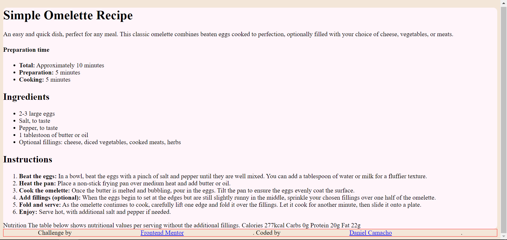
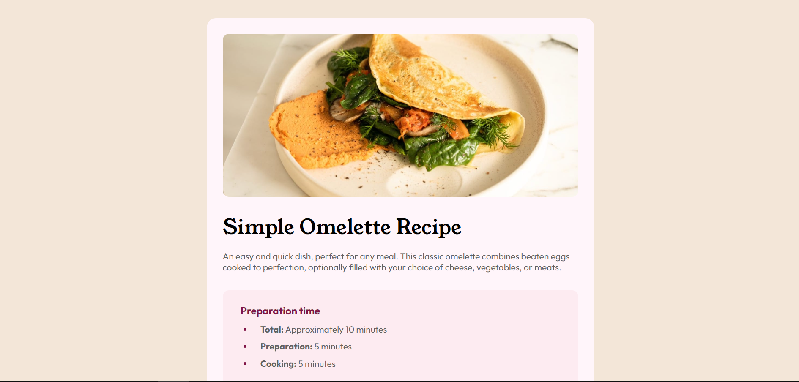

# Frontend Mentor - Recipe page solution

This is my solution to the [Recipe page challenge on Frontend Mentor](https://www.frontendmentor.io/challenges/recipe-page-KiTsR8QQKm).

## Table of contents

- [Overview](#overview)
    - [Screenshot](#screenshot)
    - [Links](#links)
- [My process](#my-process)
    - [Built with](#built-with)
    - [What I learned](#what-i-learned)
- [Author](#author)

## Overview

### Screenshot

The first screenshot of the challenge (before adding CSS)...



And this is the last screenshot of the finished page!



### Links

Link to the page in Vercel: [Recipe page challenge by Daniel Camacho](https://recipe-page-challenge-plum.vercel.app/)

Link to my Github page: [Daniel Camacho's Github page](https://github.com/danidan2905)

## My process

### Built with

The challenge was developed using HTML and CSS (flexbox) and... nothing else!

### What I learned

The CSS styles and HTML tags used weren't new for me, but I learned to color HTML elements using HSL like this:

```css
.the-most-basic-HTML-element{
    color: hsl(14, 45%, 77%);
}
```
## Author

- Frontend Profile [Daniel Camacho's Frontend Profile](https://www.frontendmentor.io/profile/danidan2905)
- Twitter (as known as X currently) [Daniel Camacho's Twitter Profile](https://twitter.com/danidan2905)